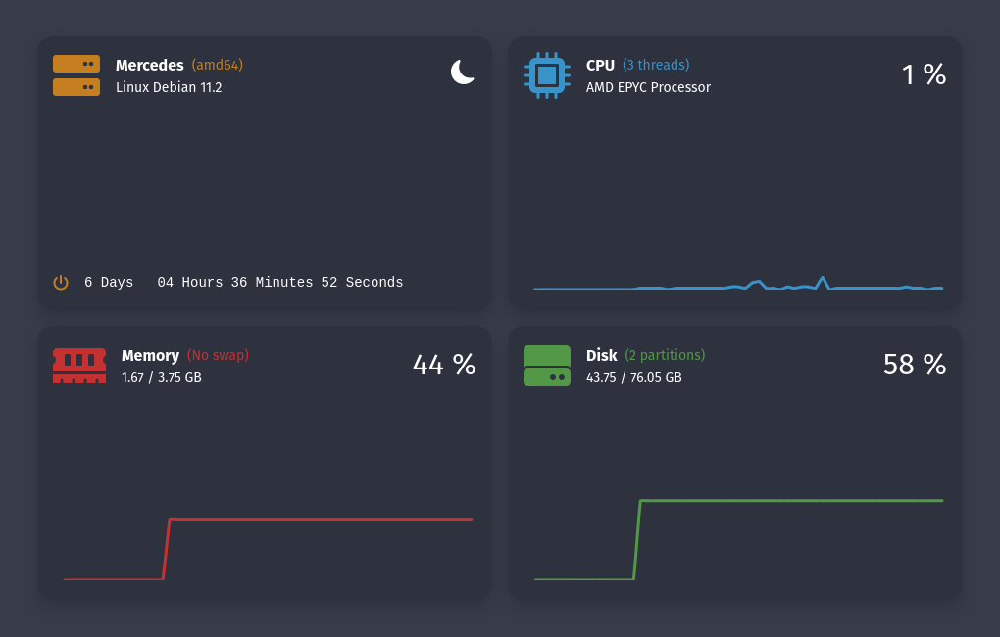
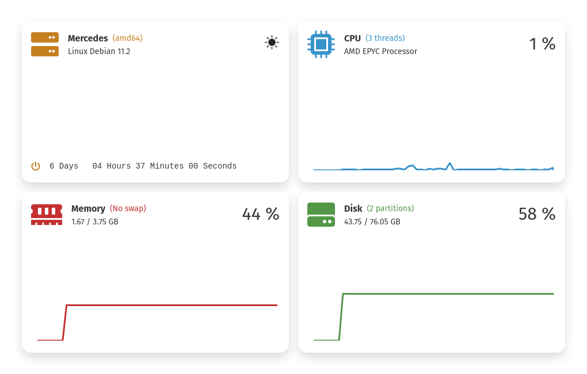

# Server Dashboard

## Dark Mode



## Light Mode



written in Go and React

[https://hub.docker.com/repository/docker/florianhoss/serverdashboard](https://hub.docker.com/repository/docker/florianhoss/serverdashboard)

## docker-compose example:

```
version: '3.9'

services:
  dashboard:
    image: florianhoss/serverdashboard:latest
    container_name: dashboard
    restart: unless-stopped
    environment:
      - GIN_MODE=release
    ports:
      - "4000:4000"
```
